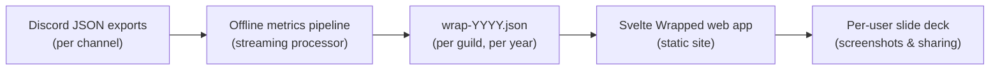

## Discord Yearly Wrapped – Project Design Document

1. Product vision

- **Goal**: Give each Discord user on a specific server a fun, highly shareable yearly "Wrapped" experience summarizing how they interacted on that server.
- **Outcome**:
  - Users can open a web page, select themselves, and see a curated sequence of slides with interesting, personalized stats.
  - Each slide is **screenshot-friendly** and visually striking, encouraging sharing with friends.
  - Stats go beyond raw counts, highlighting **relationships**, **habits**, and **unique traits**.
- **Scope (v1)**:
  - One Discord guild per generated dataset.
  - One calendar year per dataset (multiple years possible as separate exports/files).
  - Data comes from existing JSON exports produced by DiscordChatExporter.

### 2. Data source and constraints

- **Source files**: DiscordChatExporter JSON exports, one file per channel, with structure like:
  - `guild`: metadata (id, name, iconUrl, etc.).
  - `channel`: metadata (id, name, type, topic, etc.).
  - `messages`: large array of message objects.
- **Message structure** (conceptual, based on samples):
  - Identity & timing:
    - `id: string`
    - `type: string` (e.g. "Default" or system variants)
    - `timestamp: ISO 8601 string with timezone`
    - `timestampEdited?: ISO string | null`
    - `isPinned: boolean`
  - Author:
    - `author: { id, name, nickname, discriminator, isBot, avatarUrl, roles[] }`
  - Content & media:
    - `content: string`
    - `attachments[]: { id, url, fileName, fileSizeBytes, contentType? }`
    - `embeds[]`, `stickers[]` (can be counted as media but not deeply parsed in v1)
  - Social context:
    - `reactions[]: { emoji: { id, name, code, isAnimated, imageUrl }, count, users[] }`
    - `mentions[]: user objects`
    - `inlineEmojis[]: emoji objects used in content`
    - (Optionally) reply metadata such as `reference` / `referencedMessage` / `replyTo` linking to another message.
- **Constraints**:
  - Files can be **large** (hundreds of thousands of messages per file); must be processed in a streaming fashion.
  - Data is **read-only** and exported offline; there is no live connection to the Discord API.
  - Export schemas may slightly evolve; design should tolerate missing optional fields.

### 3. Primary user personas and use cases

- **Individual server member**:
  - Wants to see "their year" on the server: how much they talked, with whom, when, and in which channels.
  - Enjoys fun, slightly exaggerated labels ("Night Owl", "Emoji Machine") and comparisons ("top 5% chatter").
  - Shares screenshots of a couple favorite slides with friends.
- **Server community / admins**:
  - Want a community-wide, social event around Wrapped.
  - Want users to be able to **quickly compare** key stats (rank, total messages, persona) just by glancing at each other's summary slide.
- **Data curator (you)**:
  - Runs the offline processing script on exported JSON once per year.
  - Publishes the resulting JSON and frontend bundle as a static site.

### 4. High-level architecture (conceptual)

- **Two main subsystems**:
  - **Offline metrics pipeline**:
    - Input: one or more DiscordChatExporter JSON files for a single guild and year.
    - Process: stream through messages, compute per-user and global metrics, derive badges/personas.
    - Output: a single compact JSON file (e.g. `wrap-2024.json`) containing all data needed by the frontend.
  - **Svelte frontend web app**:
    - Input: `wrap-<year>.json` loaded at runtime.
    - Behavior: user selection + slide-based UI rendering per-user Wrapped.


- **Design intent**:
  - The **pipeline** is a batch job: can be rerun if metrics definitions change.
  - The **frontend** is purely client-side (static hosting) and does not modify data.

### 5. Metrics catalog (what the pipeline must produce)

This section defines *what* metrics exist and how they are conceptually derived. Implementation details (e.g. exact data structures, libraries) are intentionally left out.

#### 5.1 Identity and profile

For each user (non-bot) active in the given year:

- **Stable identifiers**:
  - `userId`
  - Last-seen `name`, `nickname`, `discriminator`, `avatarUrl`.
- **Design note**: The frontend always uses the latest profile information from within that year to represent the user.

#### 5.2 Core activity metrics

Per user:

- **Total messages**: number of messages authored in that year (excluding bots).
- **Message rank**: order by total messages, from most to fewest.
- **Percentile**: where they sit relative to all active users.
- **Messages per channel**: distribution of their messages across channels; provides:
  - Top 3 channels by message count.
  - Percentage share of messages in each top channel.
- **Active days**:
  - Count of distinct calendar days with at least one message.
  - Optionally, longest streak of consecutive active days (if included in v1).
- **First / last message timestamps** in the year.
- **Average message length** (characters and/or word count) as a measure of verbosity.

#### 5.3 Interaction metrics

Per user:

- **Reply-based relationships** (if reply metadata is available):
  - **Most replied-to users**: users whose messages they replied to the most.
  - **Users who reply to them the most**: users who reply most frequently to this user.
- **Mention-based relationships**:
  - **Top mentioned users**: users they @mention most often.
  - **Top mentioners of them**: users who @mention them most often.
- **Reaction-based relationships**:
  - **Top reactors to their messages**: users who have reacted to their messages most often (across all emojis).
  - **Users they react to the most**: whose messages they react to most frequently.

The design expects *counts* and associated user IDs; the frontend will later translate user IDs into names/avatars.

#### 5.4 Emoji and content flavor

Per user:

- **Top emojis sent**:
  - Includes emojis used inline in content and emojis used as reactions **they** add to others' messages.
  - For each ranked emoji: a key (e.g. `id` or `name`), display label, and usage count.
- **Top emojis received**:
  - Reactions other people add to **their** messages.
- **Text flavor** (Polish Language Specifics):
  - A small list of top words.
  - **Localization Requirement**: Must use a robust **Polish Stopword List** (removing *i, w, z, na, ale, jak, to, jest* etc.).
  - **Normalization**: Ideally perform basic **Stemming** (e.g. *kotem* -> *kot*) to group word variations, as Polish is highly inflected.
  - Used for copy like "Your year in three words".

#### 5.5 Temporal patterns

Per user:

- **Hour-of-day distribution**:
  - 24-bucket histogram of messages by hour (00–23, using a consistent timezone rule).
- **Day-of-week distribution**:
  - 7-bucket histogram (Monday–Sunday or equivalent) of messages by weekday.
- **Most active month**:
  - Month in which they sent the most messages.
- **Persona label** (derived):
  - A simple classification such as "Night Owl", "Early Bird", or "All-Day" based on hour-of-day distribution.

#### 5.6 Badges and achievements

Badges are **derived labels** summarizing interesting aspects of behavior. Each badge:

- Has a stable `id`, user-facing `label`, and `description`.
- Is attached to a user when simple rule-based conditions on the metrics are met.

Examples (rules are conceptual and can be tuned later):

- **Night Owl** – majority of messages between late night hours.
- **Early Bird** – majority of messages early in the morning.
- **Emoji Machine** – very high proportion of emoji usage.
- **React Lord** – unusually high reaction counts received.
- **Channel Hopper** – active in many different channels.
- **One-Channel Gremlin** – the vast majority of messages in a single channel.
- **The Editor** - Edited > 5% of their messages.
- **The Pinned Celebrity** - Has an unusually high number of pinned messages.
- **Gallery Curator** - High ratio of attachments/images posted.
- **Trendsetter** - Often the first to react to a message that later goes viral (>5 reactions).
- **Conversation Killer** - Frequently the last person to post in a channel for > 6 hours.
- **Double Texter** - High rate of sending multiple messages in rapid succession (bursts).
- **Ghost** - Active on many days but with very low total message count (Lurker).

#### 5.7 Advanced / Experimental Insights (Data Science)

These metrics aim to find "hidden" patterns using more advanced analysis of the chat dump, with adjustments for Polish language content.

- **Sentiment Trajectory (Mood Graph)**:
  - Monthly average sentiment score.
  - **Constraint**: Simple word lists don't work well for Polish.
  - **Strategy**: Use a **Polish Sentiment Dictionary** (e.g. NAWL - Nencki Affective Word List) OR fallback to **Emoji Sentiment Analysis** (which is language-agnostic and robust on Discord).
  - Shows if their year got "happier" or "saltier".
- **Vocabulary Fingerprint**:
  - The top 3-5 words this user uses *disproportionately more* than the server average (TF-IDF style).
  - **Requirement**: **Lemmatization/Stemming is critical**. Without it, "kurwa", "kurwie", "kurwami" are treated as different words, diluting the "fingerprint".
  - Reveals their unique slang or catchphrases.
- **Response Latency**:
  - Median time it takes for this user to reply when mentioned.
- **Chronotype / Sleep Schedule Estimation**:
  - Identify the longest consistent "quiet block" in their 24h cycle to guess their sleep window.
- **Session Analysis**:
  - **Average Session Length**: Time between their first and last message in a continuous burst of activity.
  - **Attention Span**: Average time between messages within a session.
- **Interaction Asymmetry (The "Adorator" / "Simp" Factor)**:
  - Ratio of (Replies Sent / Replies Received) for specific dyads.
  - Identifies "Fan" relationships vs. "Protagonist" roles.
- **Role Correlation**:
  - Analyze if certain roles (e.g. "Jenot", "Moderator") correlate with specific badges or activity levels.

#### 5.8 Global / guild-level metrics

The pipeline also needs to compute **server-wide** aggregates, used for context and comparison:

- Total number of messages in the year.
- Total number of active users (sent at least one message).
- Total number of distinct channels with activity.
- Top channels by total message volume.

These enable copy such as "You contributed 3% of all messages this year" or "You are in the top 5% of talkers".

### 6. Output data contract (wrap-YYYY.json)

At a high level, the output is a single JSON file per guild-year containing:

- **Metadata**: schema version, year, guild information, generation timestamp.
- **Totals**: global/guild-level metrics.
- **Users**: a map or array of `UserWrapSummary`-like objects containing all per-user metrics described in section 5.

Design considerations:

- The structure should remain **stable** across minor frontend changes; breaking changes should bump a `schemaVersion`.
- Optional fields should be treated as such in the frontend (robust to absent metrics).
- The format is **read-optimized** for the Svelte app: no need for internal implementation details like internal maps.

### 7. Frontend experience design (Svelte app)

This section describes how the Svelte app should behave and *what* it needs from the data, not how to implement it in code.

#### 7.1 Entry flow

- Landing view:
  - Shows guild name, year, and a short description of what the Wrapped is.
  - Prominent **user selection control** for picking "Who are you?".
- User selection:
  - Searchable by nickname/username.
  - Optionally accepts a `?user=<id>` URL parameter to deep-link directly to a user.
- After selection:
  - The app switches to a **full-screen slide deck** for that user.

#### 7.2 Slide deck model

- The experience is a **linear sequence of slides** (ordered list), each with a distinct theme:
  - Intro (identity + headline stat).
  - Activity overview (messages, active days, rank, biggest month).
  - Interaction (top partners, who replies to you).
  - Emoji & flavor.
  - Time-of-day persona.
  - Channels.
  - **Deep Stats (New)**: Sentiment, vocabulary, unique habits.
  - Badges.
  - Summary/comparison card.
- Navigation model:
  - Left/right arrows (or swipe on mobile).
  - Progress indicator (e.g. dots or "Slide X of Y").
  - Optional keyboard support on desktop.

#### 7.3 Slide content expectations

Each slide has a **clear mapping** from metrics (section 5) to displayed content:

- **Intro slide**:
  - Inputs: user profile, total messages, rank, guild name, year.
  - Output: a hero view with avatar, name, and one big stat line.
- **Activity slide**:
  - Inputs: totals.messages, totals.activeDays, mostActiveMonth, percentile.
  - Output: big message count, mention of active days & month, statement like "You talk more than X% of the server".
- **Interaction slide(s)**:
  - Inputs: topRepliedTo, topRepliedBy, topReactors, with user IDs resolved to names/avatars.
  - Output: 3-card layout highlighting top partners ("partners in crime"), plus short descriptive copy.
- **Emoji slide**:
  - Inputs: topSent and topReceived emojis, plus usage counts.
  - Output: big emoji glyphs and numeric counts, plus a fun tagline.
- **Time-of-day slide**:
  - Inputs: hourHistogram, persona label.
  - Output: a simple visualization of hourly activity (bars or segmented line) and a persona headline.
- **Channels slide**:
  - Inputs: per-user top channels (with names) and their percentages.
  - Output: list of top channels and describing whether the user is a "Channel Hopper" or "One-Channel Gremlin".
- **Deep Stats Slide**:
  - Inputs: vocabulary fingerprint, sentiment trajectory, session stats.
  - Output: "Your word of the year", "Mood swing graph", or "Average session: 45 mins".
- **Badges slide**:
  - Inputs: badges array.
  - Output: a grid of badges with icons and descriptions.
- **Summary/comparison slide**:
  - Inputs: a curated set of headline metrics (messages, rank, top channel, top partner, top emoji, persona).
  - Output: card-like layout optimized for sharing and quick cross-user comparison.

#### 7.4 Visual and interaction design principles

- **Screenshot-friendly**:
  - Each slide fits cleanly within a tall mobile viewport (9:16), with padding to avoid OS UI.
  - Navigation controls and chrome are positioned so they can be easily cropped out.
- **Branding and tone**:
  - **Theme**: Neo-Brutalism (using shadcn-svelte theme).
  - **Language**: All copy must be in **Polish**.
  - Copy is playful but readable; avoid overly niche references that might not generalize across users.
- **Accessibility**:
  - High color contrast; avoid relying solely on color to convey meaning.
  - Text size and line spacing tuned for readability on mobile.

#### 7.5 Technical Implementation Details

- **Framework**: Svelte / SvelteKit + shadcn-svelte.
- **Design Theme**: Neo-Brutalism.
- **Installation Command**:
  ```bash
  npx shadcn-svelte@latest add https://tweakcn.com/r/themes/neo-brutalism.json
  ```
- **Reference CSS (`index.css`)**:
  ```css
  :root {
    --background: oklch(1.0000 0 0);
    --foreground: oklch(0 0 0);
    --card: oklch(1.0000 0 0);
    --card-foreground: oklch(0 0 0);
    --popover: oklch(1.0000 0 0);
    --popover-foreground: oklch(0 0 0);
    --primary: oklch(0.6489 0.2370 26.9728);
    --primary-foreground: oklch(1.0000 0 0);
    --secondary: oklch(0.9680 0.2110 109.7692);
    --secondary-foreground: oklch(0 0 0);
    --muted: oklch(0.9551 0 0);
    --muted-foreground: oklch(0.3211 0 0);
    --accent: oklch(0.5635 0.2408 260.8178);
    --accent-foreground: oklch(1.0000 0 0);
    --destructive: oklch(0 0 0);
    --destructive-foreground: oklch(1.0000 0 0);
    --border: oklch(0 0 0);
    --input: oklch(0 0 0);
    --ring: oklch(0.6489 0.2370 26.9728);
    --chart-1: oklch(0.6489 0.2370 26.9728);
    --chart-2: oklch(0.9680 0.2110 109.7692);
    --chart-3: oklch(0.5635 0.2408 260.8178);
    --chart-4: oklch(0.7323 0.2492 142.4953);
    --chart-5: oklch(0.5931 0.2726 328.3634);
    --sidebar: oklch(0.9551 0 0);
    --sidebar-foreground: oklch(0 0 0);
    --sidebar-primary: oklch(0.6489 0.2370 26.9728);
    --sidebar-primary-foreground: oklch(1.0000 0 0);
    --sidebar-accent: oklch(0.5635 0.2408 260.8178);
    --sidebar-accent-foreground: oklch(1.0000 0 0);
    --sidebar-border: oklch(0 0 0);
    --sidebar-ring: oklch(0.6489 0.2370 26.9728);
    --font-sans: DM Sans, sans-serif;
    --font-serif: ui-serif, Georgia, Cambria, "Times New Roman", Times, serif;
    --font-mono: Space Mono, monospace;
    --radius: 0px;
    --shadow-x: 4px;
    --shadow-y: 4px;
    --shadow-blur: 0px;
    --shadow-spread: 0px;
    --shadow-opacity: 1;
    --shadow-color: hsl(0 0% 0%);
    --shadow-2xs: 4px 4px 0px 0px hsl(0 0% 0% / 0.50);
    --shadow-xs: 4px 4px 0px 0px hsl(0 0% 0% / 0.50);
    --shadow-sm: 4px 4px 0px 0px hsl(0 0% 0% / 1.00), 4px 1px 2px -1px hsl(0 0% 0% / 1.00);
    --shadow: 4px 4px 0px 0px hsl(0 0% 0% / 1.00), 4px 1px 2px -1px hsl(0 0% 0% / 1.00);
    --shadow-md: 4px 4px 0px 0px hsl(0 0% 0% / 1.00), 4px 2px 4px -1px hsl(0 0% 0% / 1.00);
    --shadow-lg: 4px 4px 0px 0px hsl(0 0% 0% / 1.00), 4px 4px 6px -1px hsl(0 0% 0% / 1.00);
    --shadow-xl: 4px 4px 0px 0px hsl(0 0% 0% / 1.00), 4px 8px 10px -1px hsl(0 0% 0% / 1.00);
    --shadow-2xl: 4px 4px 0px 0px hsl(0 0% 0% / 2.50);
    --tracking-normal: 0em;
    --spacing: 0.25rem;
  }

  .dark {
    --background: oklch(0 0 0);
    --foreground: oklch(1.0000 0 0);
    --card: oklch(0.3211 0 0);
    --card-foreground: oklch(1.0000 0 0);
    --popover: oklch(0.3211 0 0);
    --popover-foreground: oklch(1.0000 0 0);
    --primary: oklch(0.7044 0.1872 23.1858);
    --primary-foreground: oklch(0 0 0);
    --secondary: oklch(0.9691 0.2005 109.6228);
    --secondary-foreground: oklch(0 0 0);
    --muted: oklch(0.2178 0 0);
    --muted-foreground: oklch(0.8452 0 0);
    --accent: oklch(0.6755 0.1765 252.2592);
    --accent-foreground: oklch(0 0 0);
    --destructive: oklch(1.0000 0 0);
    --destructive-foreground: oklch(0 0 0);
    --border: oklch(1.0000 0 0);
    --input: oklch(1.0000 0 0);
    --ring: oklch(0.7044 0.1872 23.1858);
    --chart-1: oklch(0.7044 0.1872 23.1858);
    --chart-2: oklch(0.9691 0.2005 109.6228);
    --chart-3: oklch(0.6755 0.1765 252.2592);
    --chart-4: oklch(0.7395 0.2268 142.8504);
    --chart-5: oklch(0.6131 0.2458 328.0714);
    --sidebar: oklch(0 0 0);
    --sidebar-foreground: oklch(1.0000 0 0);
    --sidebar-primary: oklch(0.7044 0.1872 23.1858);
    --sidebar-primary-foreground: oklch(0 0 0);
    --sidebar-accent: oklch(0.6755 0.1765 252.2592);
    --sidebar-accent-foreground: oklch(0 0 0);
    --sidebar-border: oklch(1.0000 0 0);
    --sidebar-ring: oklch(0.7044 0.1872 23.1858);
    --font-sans: DM Sans, sans-serif;
    --font-serif: ui-serif, Georgia, Cambria, "Times New Roman", Times, serif;
    --font-mono: Space Mono, monospace;
    --radius: 0px;
    --shadow-x: 4px;
    --shadow-y: 4px;
    --shadow-blur: 0px;
    --shadow-spread: 0px;
    --shadow-opacity: 1;
    --shadow-color: hsl(0 0% 0%);
    --shadow-2xs: 4px 4px 0px 0px hsl(0 0% 0% / 0.50);
    --shadow-xs: 4px 4px 0px 0px hsl(0 0% 0% / 0.50);
    --shadow-sm: 4px 4px 0px 0px hsl(0 0% 0% / 1.00), 4px 1px 2px -1px hsl(0 0% 0% / 1.00);
    --shadow: 4px 4px 0px 0px hsl(0 0% 0% / 1.00), 4px 1px 2px -1px hsl(0 0% 0% / 1.00);
    --shadow-md: 4px 4px 0px 0px hsl(0 0% 0% / 1.00), 4px 2px 4px -1px hsl(0 0% 0% / 1.00);
    --shadow-lg: 4px 4px 0px 0px hsl(0 0% 0% / 1.00), 4px 4px 6px -1px hsl(0 0% 0% / 1.00);
    --shadow-xl: 4px 4px 0px 0px hsl(0 0% 0% / 1.00), 4px 8px 10px -1px hsl(0 0% 0% / 1.00);
    --shadow-2xl: 4px 4px 0px 0px hsl(0 0% 0% / 2.50);
  }

  @theme inline {
    --color-background: var(--background);
    --color-foreground: var(--foreground);
    --color-card: var(--card);
    --color-card-foreground: var(--card-foreground);
    --color-popover: var(--popover);
    --color-popover-foreground: var(--popover-foreground);
    --color-primary: var(--primary);
    --color-primary-foreground: var(--primary-foreground);
    --color-secondary: var(--secondary);
    --color-secondary-foreground: var(--secondary-foreground);
    --color-muted: var(--muted);
    --color-muted-foreground: var(--muted-foreground);
    --color-accent: var(--accent);
    --color-accent-foreground: var(--accent-foreground);
    --color-destructive: var(--destructive);
    --color-destructive-foreground: var(--destructive-foreground);
    --color-border: var(--border);
    --color-input: var(--input);
    --color-ring: var(--ring);
    --color-chart-1: var(--chart-1);
    --color-chart-2: var(--chart-2);
    --color-chart-3: var(--chart-3);
    --color-chart-4: var(--chart-4);
    --color-chart-5: var(--chart-5);
    --color-sidebar: var(--sidebar);
    --color-sidebar-foreground: var(--sidebar-foreground);
    --color-sidebar-primary: var(--sidebar-primary);
    --color-sidebar-primary-foreground: var(--sidebar-primary-foreground);
    --color-sidebar-accent: var(--sidebar-accent);
    --color-sidebar-accent-foreground: var(--sidebar-accent-foreground);
    --color-sidebar-border: var(--sidebar-border);
    --color-sidebar-ring: var(--sidebar-ring);

    --font-sans: var(--font-sans);
    --font-mono: var(--font-mono);
    --font-serif: var(--font-serif);

    --radius-sm: calc(var(--radius) - 4px);
    --radius-md: calc(var(--radius) - 2px);
    --radius-lg: var(--radius);
    --radius-xl: calc(var(--radius) + 4px);

    --shadow-2xs: var(--shadow-2xs);
    --shadow-xs: var(--shadow-xs);
    --shadow-sm: var(--shadow-sm);
    --shadow: var(--shadow);
    --shadow-md: var(--shadow-md);
    --shadow-lg: var(--shadow-lg);
    --shadow-xl: var(--shadow-xl);
    --shadow-2xl: var(--shadow-2xl);
  }
  ```

### 8. Non-functional requirements

- **Performance**:
  - Frontend must handle loading and using a JSON file containing summaries for all active users for a year without noticeable lag on typical mid-range phones.
  - It is acceptable for the initial load to take a second or two; subsequent navigation must be instant.
- **Privacy**:
  - The site is meant for members of the server; the design should include a brief explanation of where the data came from and what year it covers.
  - If needed, the data pipeline can exclude specific users (e.g. opted-out users) by ID before generating the final JSON.
- **Portability**:
  - The full experience (data + frontend) should be hostable on any static file host (e.g. GitHub Pages, Netlify, static S3 bucket).

### 9. Future extensions (out of scope for v1 but useful to note)

- Support for multiple years in a single site (year selector).
- Cross-server Wrapped (multiple guilds combined) for people active in several communities.
- Additional slide types (e.g. "most reacted message", "your most chaotic day").
- Simple per-user "redaction" (e.g. hide specific partner names) if privacy concerns arise.

### 10. Open questions and assumptions

- **Timezone choice**:
  - Should all times be computed in a fixed timezone (e.g. server owner’s local time) or UTC?
- **Reply metadata availability**:
  - Do all exported messages contain explicit reply references, or do we need heuristics for conversation detection?
- **Scale expectations**:
  - Approximate number of active users and total messages per year, to validate frontend performance assumptions.
- **Badge tuning**:
  - Exact thresholds for badges will likely need iteration after seeing real data distributions.

This document is intended as the **project design markdown** that guides later implementation work. Developers implementing the pipeline and Svelte app should use this as the source of truth for what data must be produced and how the user experience should behave, while remaining free to choose specific libraries, file layouts, and low-level implementation details that respect this design.